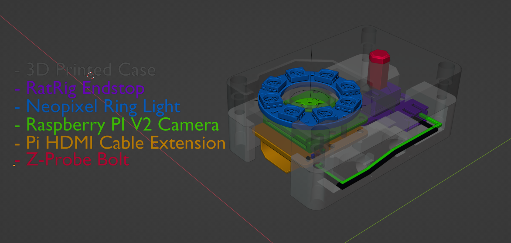
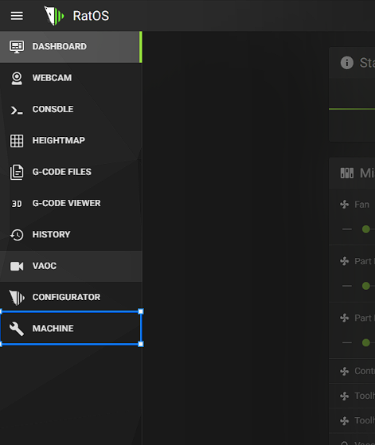
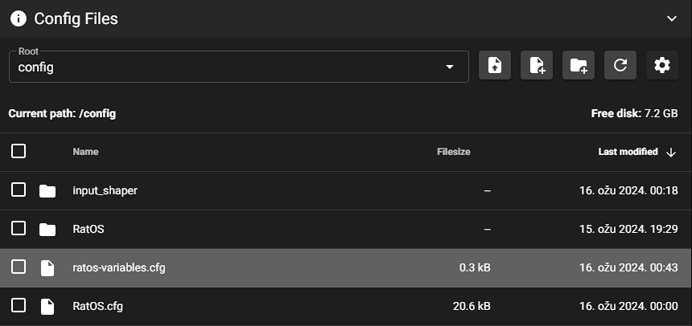
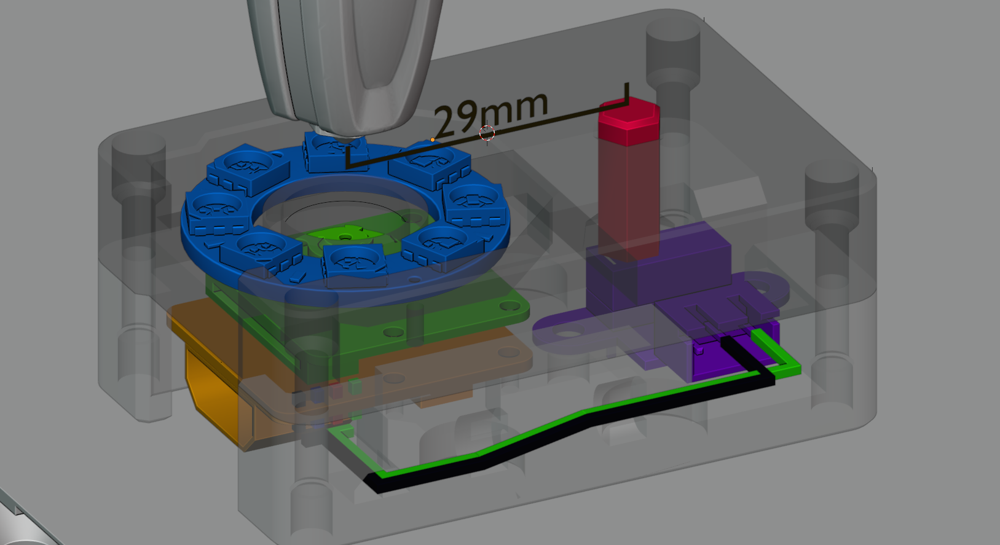
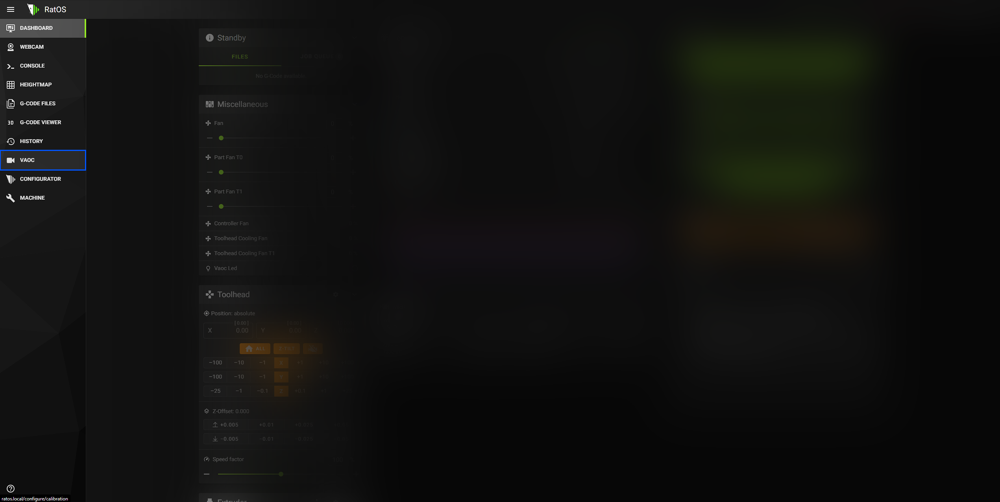
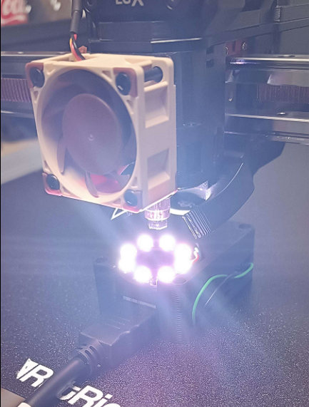
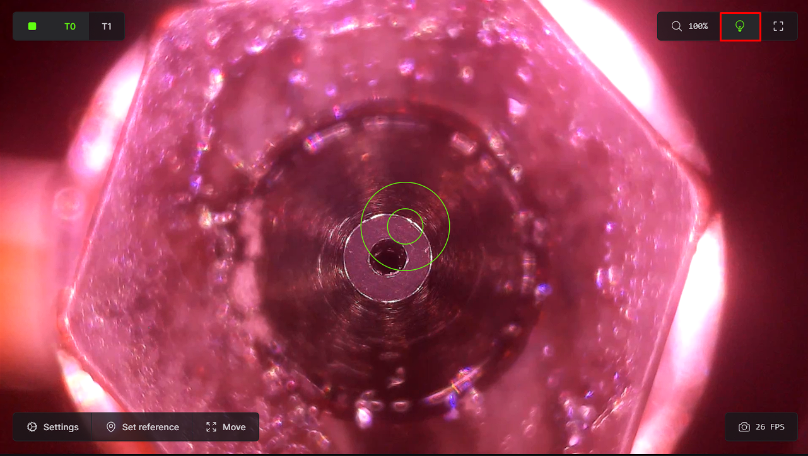
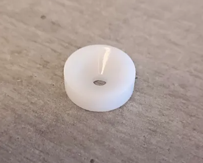
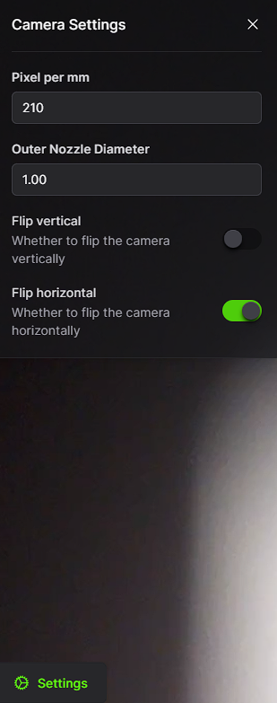

# VAOC - Visual Assisted Offset Calibration - 2.0
> [!IMPORTANT]
> VAOC is designed, programmed and integrated by **HelgeKeck** and **Miklschmidt**, all credits go to them.

> [!CAUTION]
> Disclaimer - You are actually responsible for the operation of your machine, we are not responsible for damages or improper operations while using VAOC, this is simply a comprehensive guide on how to use the system.

## What is VAOC and what does it do.
VAOC is an Mainsail integrated process, which, with the utilization of the Macro camera, can precisely calibrate and move the nozzle offset in X and Y, which is mostly needed in IDEX machines that utilize 2 or more tool heads. It also features an optional Z Offset Probing, to measure the offset in Z in both nozzles in mere seconds.
At this stage, it requires minimum input from the user.

## Features:
- Seamless integration into Mainsail
- Macros that can be adapted, and support any other non-RatOS printer.
- Drag and drop X & Y offset calibration
- Manual Z-Offset based on Camera Focus
- Optional and manual Z-Offset calibration with a switch, offering 0.00xmm accuracy.
- Optional LED control through Mainsail

## Requirements:
Needed:
- RatOS 2.1+ / Mainsail (if you use a custom fork)
- Raspberry PI Camera or a Camera with adjustable focus. (Macro camera needed for this)
- VAOC Camera case

Optional:
- Camera LED / Neopixel Ring Led
- Z Offset Endstop
- Full Camera case

## Device
For VAOC to work, a macro camera is needed that can see the nozzle at small distances with adjustable focus, it is suggested to use a Raspberry Pi camera, as it has a small footprint, alongside a Pi Camera HDMI Cable extension, so that the VAOC device and case can be connected via the HDMI cable for longer distances, to avoid using the ribbon cable.

There are various cases for the camera, which can be found on **Discord** or you can use the full VAOC camera case, which uses the RatRig endstop from @VisualTech48, and enables you to check your Z Offset as well.

> [!TIP]
> The benefit of running a case with the PI HDMI cable extender, is that it carries 4 additional pins (we need 15 for our camera, and we have 4 extra, which uses to drive the Neopixel lights and the Endstop)

## Configuration
> [!NOTE]
> Before starting VAOC, ensure that the Camera is functional in the Mainsail with Crowsnest, and name it VAOC.

If the image is black or the signal is missing you have a misconfigured camera. 

This is an EXAMPLE configuration for Raspberry PI camera V2:
```
[crowsnest]
log_path: /home/pi/printer_data/logs/crowsnest.log
log_level: verbose                      # Valid Options are quiet/verbose/debug
delete_log: false                       # Deletes log on every restart, if set to true
no_proxy: false

[cam 1]
mode: camera-streamer                   # ustreamer - Provides mjpg and snapshots. (All devices)
                                        # camera-streamer - Provides webrtc, mjpg and snapshots. (rpi + Raspi OS based only)
enable_rtsp: false                      # If camera-streamer is used, this enables also usage of an rtsp server
rtsp_port: 8554                         # Set different ports for each device!
port: 8080                              # HTTP/MJPG Stream/Snapshot Port
device: /base/soc/i2c0mux/i2c@1/imx219@10                     # See Log for available ...
resolution: 1920x1080                   # widthxheight format
max_fps: 40                             # If Hardware Supports this it will be forced, otherwise ignored/coerced.
custom_flags: --camera-height=1080 --camera-width=1920 --camera-video.height=1920 --camera-snapshot.height=1920 --camera-format=YUYV
#v4l2ctl:    
```
After the camera is set up, you need to ensure the proper clearance for the camera, which can be set up in the "**ratos-variables.cfg**", in the "**Machine**" tab in Mainsail. This is a sanity check.




> [!WARNING]
> Do not change any of the settings of this file, besides **_zcontrolpoint =** this value changes our Z (_Bed position_) for the start of our **VAOC** calibration. (If the value is **50.0**, when you click _Start Calibration_ in VAOC, your Bed will go down by **50.0**).

This value doesn't have to be exact, the VAOC system offers to change the Z, however, it has to give enough clearance for the VAOC Camera case to go down. So this value depends on your case thickness.

_ratos-variables.cfg_

```
[Variables]
idex_applied_offset = 0
idex_xcontrolpoint = 200.0
idex_xoffset = 0.0
idex_ycontrolpoint = 50.0
idex_yoffset = 0.0
idex_zcontrolpoint = 50.0
idex_zoffset = 0.0
idex_zoffsetcontrolpoint = 50.0
```
### Optional configuration
> [!IMPORTANT]
> It is heavily recommended that you use some type of LEDs with the camera, so you and the system can see the nozzle properly.

#### Configurarating VAOC Neopixel lights:
> [!IMPORTANT]
> It is important for proper functionality that the LED name is "**vaoc_led**".
> 
> This is an example code, your PIN definition will vary from board to board, the NEOPixel light needs 3 free GPIO pins to work properly.
> -  `Red - 5V` 
> -  `Blue - Data` 
> -  `Black - Ground`
> - pin: is the Blue Data Cable

```
[neopixel vaoc_led]
pin: PE10
chain_count: 8
color_order: GRB
initial_RED: 0.0
initial_GREEN: 0.0
```

#### Configurarating Z-Offset-Probe
> [!TIP]
> For IDEX machines that want to utilize the most out of the machine it is recommended to have a physical z-offset check, to ensure both, or multiple nozzles are at the same height.

To configure the Z-Offset-Probe, the case needs to have a physical probe that the nozzle will activate. 
> [!NOTE]
> For this example we are using VisualTech48 VAOC Case. It has approximately 29mm between the **Center of the camera** and the **Probe Point** on the Y.
>
> It is always recommended to take a ruler, or move the machine from the centre of the camera towards your Probe Point and measure it exactly.



This is an example configuration, you have to define your own pin to use. VAOC works with any endstop, the only requirement is that it is wired correctly.

 `Signal`

 `Black - Ground`

Configuration in __printer.cfg__
```
[z_offset_probe]
pin: ^PF0                     # probe trigger pin     
z_offset: 28.35               # probe height, used to limit the probe z-move
y_offset: 29.0                # probe y-offset, measured from the camera centre
x_offset: 0                   # probe x-offset, measured from the camera centre
speed: 10                       
samples: 3                    # number of samples  
sample_retract_dist: 5
lift_speed: 10.0
samples_result: median
samples_tolerance: 0.2
samples_tolerance_retries: 5
```
> [!CAUTION]
> Incorrect values for the `pin: ^PF0`, `z_offset: 28.35 `, `y_offset: 29.0 t`, `x_offset: 0`, may result in crashed bed/broken camera when doing Z-Offset-Check! Triple-check everything!

To test if the Z-Offset-Endstop is wired correctly, you can use the following command: `Z_OFFSET_QUERY_PROBE`, with a physical click test, by engaging the endstop, and checking if it changes state by rerunning `Z_OFFSET_QUERY_PROBE`.


> [!IMPORTANT]
> If the endstop appears to have an inverted signal (Triggered when it should be opened and vice versa, you can put a **!** before the pin name. Ie. `pin: ^!PF0`

## Entering the VAOC Calibration
If the camera is set up properly and working, you are ready for the next step which is entering the VAOC calibration. 

To enter the calibration, press the VAOC button on the left side of the menu.



Please allow the system a few seconds to open up the VAOC calibration. Press "Start Calibration on the upper left corner. 
> [!IMPORTANT]
> If you haven't homed the machine, it will home now.
> After it homes or if it already is homed, the machine will go towards the position that is written in `ratos-variables.cfg`, `_xcontrolpoint, _yxcontrolpoint, _zxcontrolpoint`

When the machine is done moving towards the `ratos-variables.cfg` values, you can now place the VAOC Case as close as to the nozzle center as you can.



> [!TIP]
> You can enable the LEDs by clicking on the Light icon on the top right side!

### Setting the camera focus
Now that you have your nozzle close enough to the camera centre, you need to ensure it's in focus, and turn it into a macro lens. If you have a PI camera, this is quite simple, use the white circular tool you received, and unscrew the camera, almost till its unscrewed in full:

_Lens unscrewing plastic:_



Once you've unscrewed it as much as you can without popping it out, click on the **Move** button in VAOC interface, and move the bed height with **VAOC Z Focus tool**, until you get a **clear** and **crisp** image of the **tip of the nozzle**, like so:


> [!WARNING]
> If moving the camera centre towards the nozzle results in the toolhead going in the wrong direction/s, you need to flip the image horizontally/vertically in the **Settings** tab!

After moving the circle towards the centre as close as you can, you need to ensure that the PixelPerMM is correct, that depends on your nozzle inner and outer size. 

This can be accessed on the Settings button. Change this till the outer circle and the inner circle match. In this case that was 210mm.



Video: 

> [!TIP]
> You can use the mouse wheel to zoom in on the nozzle.

> [!WARNING]
> If T0 and T1 have incorrect endstop configuration, you might not be able to see T1 when you call for it on VAOC. Please ensure the configuration of the endstops for DC and X is proper and that the offset between T0(X) and T1(DC) is not higher than **2mm**.
 
When the green circles are as close to the centre as they can be, click on the "Set Reference" button to set the reference which will be used for T1 positioning and offset.

After you've set the reference go to the second toolhead by clicking on the **T1** button on the top left corner, and drag and drop the green circle again till it gets towards the center of the T1 toolhead.
Explanatory video:


### Optional Z-Offset Calibration
> [!CAUTION]
> Before doing Z-Offset Calibration, make sure that the values for the `pin: ^PF0`, `z_offset: 28.35 `, `y_offset: 29.0 t`, `x_offset: 0`, inside `printer.cfg` are correct! Incorrect settings may result in a crashed bed and/or broken camera when doing Z-Offset-Check! Triple-check everything!
Video explaining what happens during Z-Offset-Calibration:


To calibrate the Z-Offset between 2 nozzles it comes down to a few simple steps:

- Make sure that the nozzle tip is in the camera centre.
- Go to T1 to ensure that T1 has properly calibrated offset.
- Go back to T0, and click on **"Z-Probe"**
- Go to T1, and after making sure it's again in the centre, click again on **"Z-Probe**".

Voila, your Z-Offsets are now probed and the offset between them has been applied!


